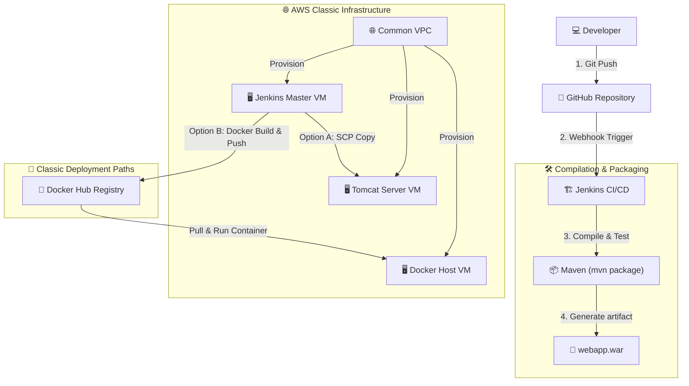
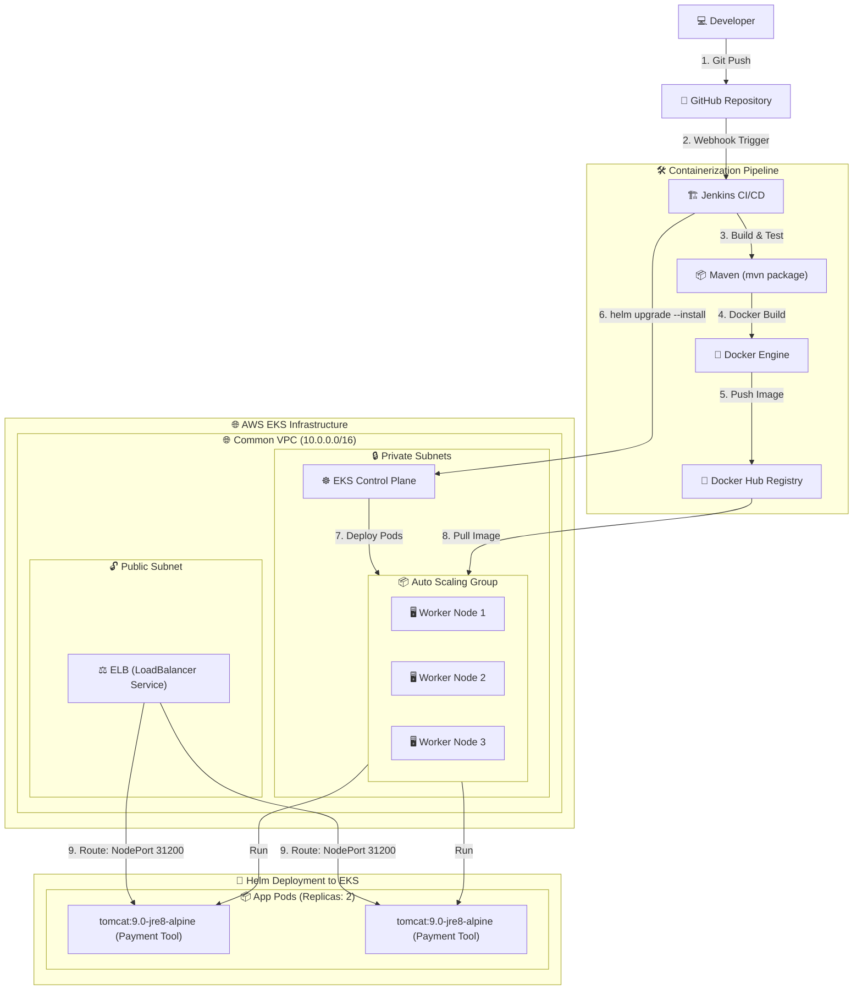

# CDP Project (Continuous Delivery Pipeline)


This repository contains a full Continuous Delivery Pipeline demonstrating how to deploy a secure, Java-based Payment Web Application using Terraform for AWS infrastructure setup, Ansible for server configurations, and Jenkins for automated pipelines.

---

## 📐 1. Classic Infrastructure & Deployment (Tomcat & Docker)

Below is the workflow showing the classic deployment pipeline targeting dedicated EC2 VMs (Tomcat and Docker hosts):



---

## ☸️ 2. Kubernetes Infrastructure & Deployment (AWS EKS & Helm)

Below is the infrastructure topology and delivery workflow of the containerized application targeting the AWS EKS Cluster using Helm:



---

## Repository Structure

* **[server/](file://server/)**: Core Java library containing business logic (Payment Processing, transfers, transaction logs, and unit tests).
* **[webapp/](file://webapp/)**: Java Servlet & JSP Web Application frontend containing user dashboards.
* **[terraform/](file://terraform/)**: Infrastructure as Code configs for provisioning VPC, subnets, route tables, security groups, and 3 EC2 nodes (Jenkins, Tomcat, Docker) in AWS.
* **[terraform/ansible/](file://terraform/ansible/)**: Playbooks for bootstrapping Tomcat, Docker CE, and Jenkins Masters on EC2 instances.
* **[packer/](file://packer/)**: OS hardening and pre-built base images configurations.

---

## Prerequisites & Installation

### 1. Setup SSH Key
The Terraform script expects an SSH public key to associate with the created instances. You can define its location using the `public_key_path` variable:
```sh
terraform apply -var="public_key_path=~/.ssh/id_rsa.pub"
```

### 2. Configure Ansible Vault Password
The Ansible variables in `terraform/ansible/vars/variables.yml` are encrypted using Ansible Vault. To decrypt them during deployment, you need to create a `.vault_pass` file inside the `terraform/ansible/` folder:
1. Copy the example file:
   ```sh
   cp terraform/ansible/.vault_pass.example terraform/ansible/.vault_pass
   ```
2. Open `terraform/ansible/.vault_pass` and replace the placeholder text with your actual Vault password.

---

## CI/CD Pipelines

1. **GitHub Actions (CI)**:
   * Triggers on pull requests and pushes to `master`.
   * Automatically builds and tests the Java application (Java 8).
   * Automatically initializes and validates the Terraform syntax.
2. **Jenkinsfile (CD)**:
   * Declarative pipeline in [Jenkinsfile](file://Jenkinsfile) with parallel deployment stages.
   * Compiles Java application into `.war` package.
   * Performs three deployment strategies: classic deployment to Tomcat server, containerized deployment to Docker host, and Kubernetes deployment to EKS cluster via Helm.
